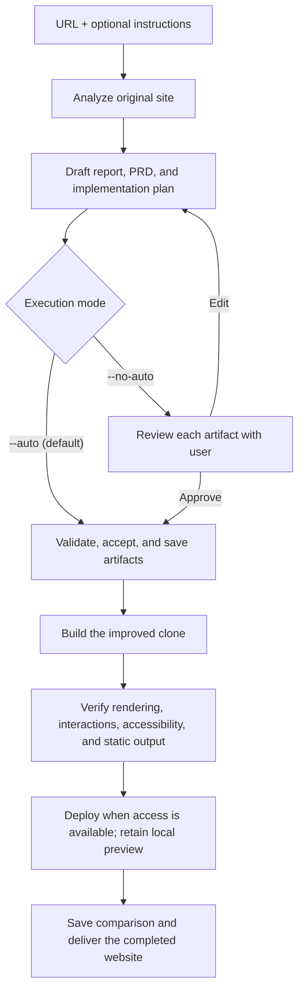

<!--
  DO NOT READ THIS FILE — This README.md is for human catalog browsing only.
  It ships inside the .skill package but is NEVER auto-loaded into agent context.
  The runtime loader only reads SKILL.md + references/ + scripts/ + agents/ when the skill triggers.
  If you're an AI agent, read the SKILL.md file instead for skill instructions.
-->

# Website Cloner

> Autonomous website cloning and improvement from a URL and optional instructions. Delivers a verified Vite + React + shadcn/ui + Tailwind CSS site, deployed to GitHub Pages when access is available.

## Highlights

- Orchestrates 6 sibling skills end-to-end: analyze, report, propose, plan, build, final report
- `--auto` is enabled by default: validates and accepts reports and plans, then completes the build and delivery without intermediate approval prompts
- `--no-auto` restores user review gates after the report, proposal, and plan phases
- Produces `prd.md` (improvement proposal) and `tasks.md` (phased implementation plan)
- Verifies responsive layouts, accessibility, interactions, routes, assets, and the static build
- Delivers the live site when deployment is available, otherwise a verified local build and preview with the deployment gap recorded

## When to Use

| Say this... | Skill will... |
|---|---|
| "clone this site https://example.com" | Run the full 6-phase pipeline |
| "rebuild this website" | Start analysis and produce an improved version |
| "make a better version of <url>" | Analyze, propose improvements, and build |

## How It Works



## Usage

```
$website-cloner https://example.com
$website-cloner https://example.com Improve mobile readability and preserve the brand --auto
$website-cloner https://example.com --no-auto
```

A URL alone runs the entire workflow. Output defaults to a new dated folder under `./clones`; use `--output <root>` or `CLONE_DIR` to choose a different root. Optional instructions guide every phase. Auto acceptance does not bypass environment permissions or a later user instruction to stop.

## Resources

| Path | Description |
|---|---|
| `website-analyzer/` | Phase 1: analyze the URL into `analysis.json` |
| `website-clone-report/` | Phase 2: plain-language `report.md`, mode-aware acceptance |
| `website-improvement-prd/` | Phase 3: improvement proposal `prd.md`, mode-aware acceptance |
| `website-implementation-plan/` | Phase 4: phased `tasks.md`, mode-aware acceptance |
| `website-builder/` | Phase 5: build, deploy to GitHub Pages, and emit `builder-metadata.json` |
| `website-clone-final-report/` | Phase 6: before/after comparison `final-report.md` |
| `LICENSE` | MIT license |

## Output

- `analysis.json` — Phase 1 structured analysis
- `report.md` — Phase 2 plain-language report (approved)
- `prd.md` — Phase 3 improvement proposal with metrics
- `tasks.md` — Phase 4 phased implementation plan
- Completed cloned website — verified live URL or local preview, source project, and `dist/` static artifact
- `builder-metadata.json` — task outcomes, verification evidence, preview restart command, deployment status, and comparable after snapshot
- `final-report.md` — Phase 6 before/after comparison
