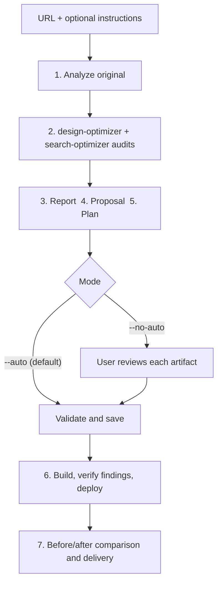

<!--
  DO NOT READ THIS FILE — This README.md is for human catalog browsing only.
  It ships inside the .skill package but is NEVER auto-loaded into agent context.
  The runtime loader only reads SKILL.md + references/ + scripts/ + agents/ when the skill triggers.
  If you're an AI agent, read the SKILL.md file instead for skill instructions.
-->

# Website Cloner

> Rebuild a website from its URL into an improved Vite + React + shadcn/ui + Tailwind CSS clone. One run analyzes the original, audits its design and search visibility, plans the fixes, builds and verifies them, and deploys to GitHub Pages when access is available.

## Highlights

- One self-contained skill with seven phases: analyze, audit, report, propose, plan, build, compare
- Runs `design-optimizer` and `search-optimizer` on the original site; every finding becomes a PRD change, a task, and a checked result in the clone
- `--auto` is the default: no approval prompts between phases
- `--no-auto` adds review gates after the report, proposal, and plan
- `--no-optimize` skips the audits; `--agent-scan` allows one isitagentready.com scan of the original URL
- Delivers the live site, or a verified local build and preview with the deployment gap recorded

## When to Use

| Say this... | Skill will... |
|---|---|
| "clone this site https://example.com" | Run all seven phases |
| "rebuild this website and fix its design and SEO" | Audit the original, then build the fixes into the clone |
| "make a better version of <url>" | Analyze, audit, propose, build, and deliver |

Not for exact mirrors, backend apps, or audit-only work (use `design-optimizer` or `search-optimizer` directly).

## How It Works



## Usage

```
$website-cloner https://example.com
$website-cloner https://example.com Keep the brand, improve mobile readability
$website-cloner https://example.com --no-auto --agent-scan
$website-cloner https://example.com --no-optimize
```

Output goes to a new dated folder under `./clones`; use `--output <root>` or `CLONE_DIR` to change it. The audits write to a temp folder outside any git checkout, then their reports are copied into `optimization/` in the project.

## Requirements

- Node.js and npm; a page-fetch or browser tool
- Optional: `design-optimizer` and `search-optimizer` installed (missing ones are skipped and the result is PARTIAL); `asm` for dependency leases; GitHub access for deployment

## Resources

| Path | Description |
|---|---|
| `SKILL.md` | Invocation, phases, delivery contract |
| `references/analyze.md` | Phase 1 analysis steps, SEO rubric, JSON schema |
| `references/optimize.md` | Phase 2 audit orchestration and `findings.md` format |
| `references/report.md`, `report-template.md`, `analysis-fields.md` | Phase 3 plain-language report |
| `references/prd.md` | Phase 4 proposal structure |
| `references/plan.md`, `tasks-template.md` | Phase 5 plan |
| `references/build.md`, `deploy.md` | Phase 6 build, verification, Pages deploy, metadata |
| `references/final-report.md`, `final-report-template.md`, `delta-computation.md` | Phase 7 comparison |
| `references/seo-scoring.md` | `score_seo.py` contract |
| `scripts/` | `score_seo.py`, `compute_deltas.py` (stdlib only) |
| `tests/` | Fixtures for both scripts |

## Output

- `analysis.json`, `after-analysis.json` — baseline and post-deploy snapshots
- `optimization/` — `design-optimization.md`, `search-optimization.md`, `findings.md`
- `report.md`, `prd.md`, `tasks.md` — report, proposal, plan
- The website source, `dist/`, and a live or local preview URL
- `builder-metadata.json` — verification, findings status, deployment, after snapshot
- `final-report.md` — before/after comparison and findings status
