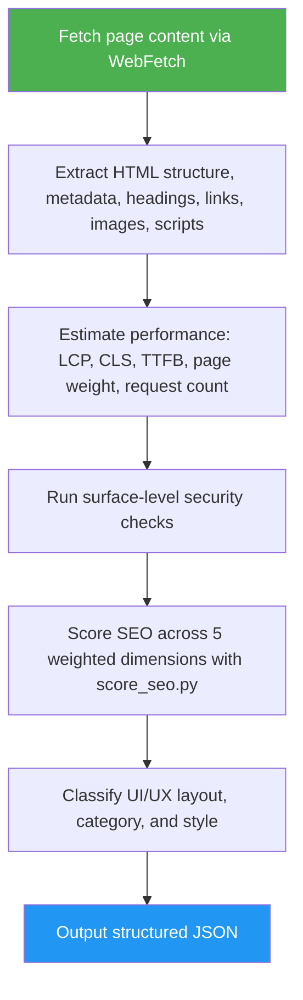

<!--
  DO NOT READ THIS FILE — This README.md is for human catalog browsing only.
  It ships inside the .skill package but is NEVER auto-loaded into agent context.
  The runtime loader only reads SKILL.md + references/ + scripts/ + agents/ when the skill triggers.
  If you're an AI agent, read the SKILL.md file instead for skill instructions.
-->

# Website Analyzer

> Analyzes any website URL across 6 dimensions: UI/UX, category, style, performance, surface-level security, and SEO.

## Highlights

- 6-dimensional analysis: UI/UX, category, style, performance, security, SEO
- Structured JSON output consumable by downstream website-cloner skills
- Performance estimates: LCP, CLS, TTFB, page weight, request count
- SEO scoring: 0–100 overall with weighted per-dimension breakdown

## When to Use

| Say this... | Skill will... |
|---|---|
| "analyze https://example.com" | Run full 6-dimension analysis |
| "scan this website for SEO" | Produce SEO score with dimension breakdown |
| "what's the performance of <url>?" | Estimate LCP, CLS, TTFB, page weight, requests |

## How It Works



## Usage

```
/website-analyzer https://example.com
```

The slash command applies when this skill is installed as a top-level skill. Inside the website-cloner suite, the orchestrator loads this SKILL.md directly.

## Resources

| Path | Description |
|---|---|
| `references/seo-scoring.md` | SEO score helper contract: input schema, weights, null handling, and safe CLI invocation |
| `scripts/score_seo.py` | Pure-stdlib helper that validates the five SEO dimension scores and computes the weighted overall score |
| `tests/` | Unit tests for `score_seo.py` |
| `LICENSE` | MIT license |

## Output

Structured JSON covering UI/UX, category, style, performance, security, and SEO dimensions.
