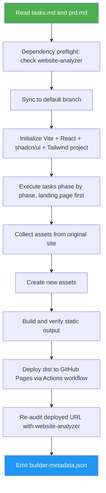

<!--
  DO NOT READ THIS FILE — This README.md is for human catalog browsing only.
  It ships inside the .skill package but is NEVER auto-loaded into agent context.
  The runtime loader only reads SKILL.md + references/ + scripts/ + agents/ when the skill triggers.
  If you're an AI agent, read the SKILL.md file instead for skill instructions.
-->

# Website Builder

> Executes the approved tasks.md to build a Vite + React + shadcn/ui + Tailwind CSS website deployable to GitHub Pages. Emits builder metadata for the final report.

## Highlights

- Full implementation: Vite + React + shadcn/ui + Tailwind CSS
- Executes tasks phase by phase (landing page first)
- Collects assets from original site, creates new assets per plan
- Deploys to GitHub Pages, emits builder metadata for Phase 6

## When to Use

| Say this... | Skill will... |
|---|---|
| "build the website from tasks.md" | Execute full implementation plan |
| "implement the PRD" | Code the improved website |
| "code a Vite/React website from this spec" | Build it with Vite + React + shadcn/ui + Tailwind CSS |

## How It Works



## Usage

```
/website-builder <tasks.md> <prd.md>
```

The slash command applies when this skill is installed as a top-level skill. Inside the website-cloner suite, the orchestrator loads this SKILL.md directly.

## Output

- Built website deployed to GitHub Pages
- `builder-metadata.json` — metadata for final comparison report
