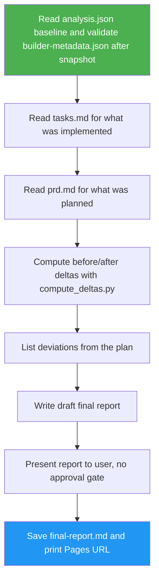

<!--
  DO NOT READ THIS FILE — This README.md is for human catalog browsing only.
  It ships inside the .skill package but is NEVER auto-loaded into agent context.
  The runtime loader only reads SKILL.md + references/ + scripts/ + agents/ when the skill triggers.
  If you're an AI agent, read the SKILL.md file instead for skill instructions.
-->

# Website Clone Final Report

> Produces a before/after comparison report of a website clone project. Uses Phase 1 analysis as baseline, builder metadata as "after" snapshot.

## Highlights

- Before/after comparison: performance, SEO, security, UI/UX deltas with clear metrics
- Plain-language descriptions of UI/UX changes with concrete examples
- Deviations from the plan listed explicitly
- GitHub Pages URL included prominently

## When to Use

| Say this... | Skill will... |
|---|---|
| "generate a final report for the clone" | Produce before/after comparison report |
| "what changed after the rebuild?" | Show before/after deltas per dimension |
| "produce a project closure summary for the website improvement" | Summarize what shipped, deviations from plan, and the Pages URL |

## How It Works



## Usage

```
/website-clone-final-report <analysis.json> <builder-metadata.json>
```

The slash command applies when this skill is installed as a top-level skill. Inside the website-cloner suite, the orchestrator loads this SKILL.md directly.

## Resources

| Path | Description |
|---|---|
| `references/final-report-template.md` | Output template that fixes the `final-report.md` section order and table shapes |
| `references/delta-computation.md` | Delta helper contract: input/output schema and CLI invocation |
| `scripts/compute_deltas.py` | Pure-stdlib helper that validates comparison records and computes before/after deltas |
| `tests/` | Unit tests for `compute_deltas.py` |
| `LICENSE` | MIT license |

## Output

`final-report.md` — before/after comparison for stakeholder handoff.
