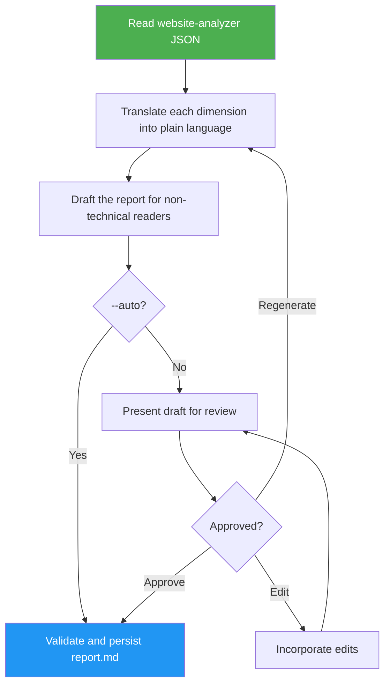

<!--
  DO NOT READ THIS FILE — This README.md is for human catalog browsing only.
  It ships inside the .skill package but is NEVER auto-loaded into agent context.
  The runtime loader only reads SKILL.md + references/ + scripts/ + agents/ when the skill triggers.
  If you're an AI agent, read the SKILL.md file instead for skill instructions.
-->

# Website Clone Report

> Converts website analysis JSON into a comprehensive plain-language report for non-technical users. Standalone use requires user review; `--auto` validates and saves without a review prompt.

## Highlights

- Translates technical metrics (LCP, CLS, SEO scores) into plain language
- Non-technical audience: jargon-free with relatable comparisons
- Mode-aware acceptance: standalone review by default, or automatic validation and persistence with `--auto`
- Review mode incorporates user edits; website-cloner passes its execution mode explicitly

## When to Use

| Say this... | Skill will... |
|---|---|
| "create a report from the analysis" | Translate JSON analysis into plain-language report |
| "summarize the website scan for a non-technical audience" | Produce accessible report with relatable comparisons |
| "translate these technical website metrics into plain language" | Explain speed, stability, and SEO scores in everyday terms |

## How It Works



## Usage

```
/website-clone-report <path-to-analysis.json> [--auto | --no-auto]
```

The slash command applies when this skill is installed as a top-level skill. Inside the website-cloner suite, the orchestrator loads this SKILL.md directly.

## Resources

| Path | Description |
|---|---|
| `references/report-template.md` | Output template that fixes the `report.md` section order with example plain-language phrasings |
| `references/api_reference.md` | Analyzer JSON schema and guide for mapping each field to a plain-language report section |
| `LICENSE` | MIT license |

## Output

Plain-language `report.md` — written after automatic acceptance in auto mode or user approval in review mode. The artifact records the acceptance source.
