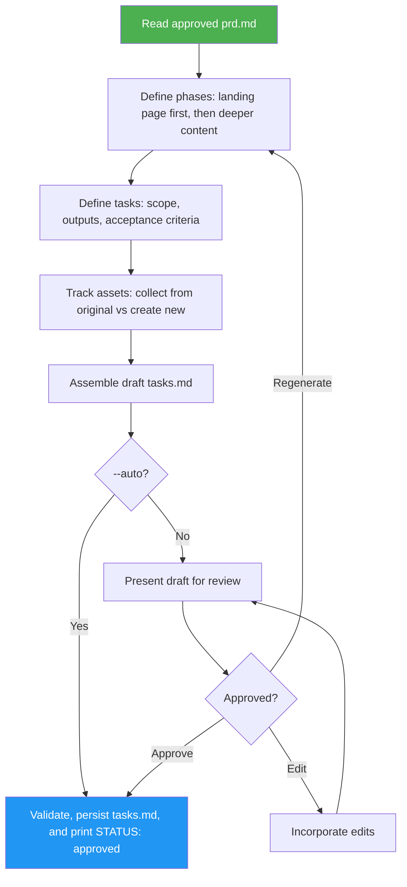

<!--
  DO NOT READ THIS FILE — This README.md is for human catalog browsing only.
  It ships inside the .skill package but is NEVER auto-loaded into agent context.
  The runtime loader only reads SKILL.md + references/ + scripts/ + agents/ when the skill triggers.
  If you're an AI agent, read the SKILL.md file instead for skill instructions.
-->

# Website Implementation Plan

> Turns approved prd.md into a phased implementation plan with landing page first, asset collection vs creation, individual tasks. Writes tasks.md after user approval or validated `--auto` acceptance.

## Highlights

- Phased plan: landing page first (usable early), then deeper pages, then optimization
- Each task has scope, outputs, and acceptance criteria
- Asset tracking: distinguishes collect-from-original vs. create-new
- Review mode by default for standalone use; `--auto` validates, accepts, and saves without a review prompt

## When to Use

| Say this... | Skill will... |
|---|---|
| "plan the implementation from the PRD" | Create phased tasks.md |
| "break down the improvement proposal into tasks" | Produce sequenced implementation plan |
| "create an implementation plan for the site rebuild" | Put the landing page first and tag each asset collect or create |

## How It Works



## Usage

```
/website-implementation-plan <prd.md> [--auto | --no-auto]
```

The slash command applies when this skill is installed as a top-level skill. Inside the website-cloner suite, the orchestrator loads this SKILL.md directly.

## Resources

| Path | Description |
|---|---|
| `references/tasks-template.md` | Output template for `tasks.md`: phase order, per-task fields, Asset Summary, and the GitHub Pages artifact deployment task |
| `LICENSE` | MIT license |

## Output

`tasks.md` — phased implementation plan ready for the builder skill, recording acceptance source. Successful persistence returns `STATUS: approved` in either mode.
