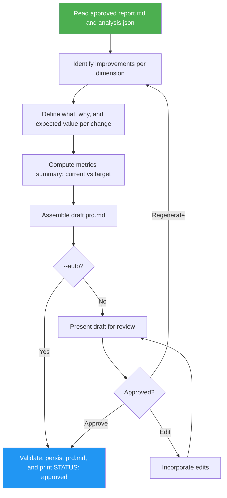

<!--
  DO NOT READ THIS FILE — This README.md is for human catalog browsing only.
  It ships inside the .skill package but is NEVER auto-loaded into agent context.
  The runtime loader only reads SKILL.md + references/ + scripts/ + agents/ when the skill triggers.
  If you're an AI agent, read the SKILL.md file instead for skill instructions.
-->

# Website Improvement PRD

> Turns approved end-user report into a full improvement proposal with what/why/value for each change. Writes prd.md after user approval or validated `--auto` acceptance.

## Highlights

- Every proposed change includes what, why, and measurable expected-value statement
- Metrics summary table: before/after targets per dimension
- Review mode by default for standalone use; `--auto` validates, accepts, and saves without a review prompt
- Structured for downstream consumption by website-implementation-plan

## When to Use

| Say this... | Skill will... |
|---|---|
| "propose improvements for this site" | Create improvement proposal with metrics |
| "create a PRD for the website rebuild" | Write structured prd.md |
| "plan improvements with measurable metrics" | Pair each change with current vs. target values |

## How It Works



## Usage

```
/website-improvement-prd <report.md> <analysis.json> [--auto | --no-auto]
```

The slash command applies when this skill is installed as a top-level skill. Inside the website-cloner suite, the orchestrator loads this SKILL.md directly.

## Output

`prd.md` — structured improvement proposal with what/why/value per change and acceptance source. Successful persistence returns `STATUS: approved` in either mode.
